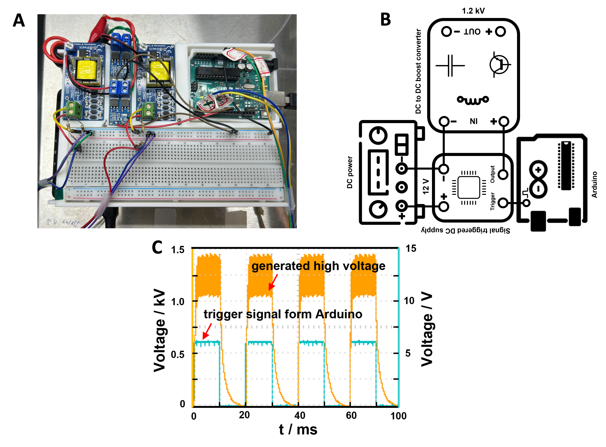

# image-activated-droplet-sorter

Open-source hardware and software for building a label-free, image-activated
microfluidic droplet sorting system.

The sorter uses a camera to image droplets in a microfluidic chip, a
YOLOv5s/TensorRT detector to classify each droplet, a virtual gate to decide
when a target droplet should be triggered, and an Arduino-controlled
high-voltage pulse generator to actuate selected droplets by dielectrophoresis.


## What This Project Builds

This repository is intended to let another lab reproduce the complete sorting
system:

- microfluidic sorting chip with liquid-metal electrodes
- microscope-mounted camera imaging the droplet channel
- Windows GPU workstation running real-time YOLO/TensorRT inference
- Arduino firmware that converts serial commands into timed trigger pulses
- low-cost high-voltage pulse generator for electrode actuation
- training and dataset preparation tools for adapting the detector

The demonstrated configuration targets single-cell droplet sorting with three
classes:

- `0`: empty droplet
- `1`: single-cell droplet
- `2`: multi-cell droplet

## Repository Layout

```text
image-activated-droplet-sorter/
├── software/      Real-time sorter and dataset preparation tools
├── firmware/      Arduino trigger sketches
├── models/        YOLOv5s and TensorRT model artifacts
├── hardware/      Chip, holder, and high-voltage generator resources
├── docs/          Reproduction, setup, tuning, and safety guides
└── media/         Figures and demo videos
```

## Reproduction Path

1. Read `docs/safety.md` before handling the high-voltage generator.
2. Fabricate or order the chip using `hardware/microfluidic_chip/`.
3. Print or machine the holders in `hardware/holders/`.
4. Assemble the high-voltage trigger chain from
   `hardware/high_voltage_generator/`.
5. Install the Windows software environment with `docs/software_setup.md`.
6. Upload the Arduino firmware from `firmware/`.
7. Run camera, serial, and model dry runs with high voltage disconnected.
8. Tune ROI, virtual-gate position, delay bins, voltage, and flow rates.
9. Enable high voltage only after all dry-run checks pass.

## Key Demonstration Parameters

These values are starting points, not universal settings. Re-tune them for your
camera, magnification, chip, droplet speed, and channel geometry.

| Subsystem | Starting value |
| --- | --- |
| Camera | 120 FPS target acquisition |
| Runtime frame | 1280 x 640 every 10 ms |
| Detector | YOLOv5s with TensorRT runtime |
| ROI crop | 160 px high; configurable width and x/y offset |
| Model input | 160 x 160 training crops |
| Inference target | less than 5 ms per input image |
| Sorting workflow | up to 100 Hz in the demonstrated setup |
| Actuation pulse | approximately 1.2 kV for 4 ms |
| Droplet actuation delay | about 120 ms in the demonstrated setup |
| Main channel width | 145 um |
| Typical droplet diameter | about 40 um |
| Typical droplet interval | about 100 um |
| Electrode width/gap | 20 um / 20 um |
| Positive electrode protrusion | 20 um |
| Demonstration accuracy | 96.4% after tuning |

Example flow-rate starting points:

- cell suspension: 0.17 uL/min
- continuous oil phase: 2.8 uL/min
- spacing oil: 0.4 uL/min
- droplet reinjection: 2.97 uL/min

## Quick Start

Install Python dependencies on the Windows GPU workstation:

```powershell
pip install -r software/requirements-windows.txt
```

Run the real-time sorter:

```powershell
python software/realtime_sorting/sort_with_tensorrt.py --serial-port COM5 --camera-index 0
```

Common parameters:

```powershell
python software/realtime_sorting/sort_with_tensorrt.py `
  --serial-port COM5 `
  --camera-index 0 `
  --frame-roi-start-x 260 `
  --frame-roi-start-y 230 `
  --frame-roi-width 640 `
  --gate-position 290 `
  --threshold 50 `
  --confidence 0.88
```

See `docs/software_setup.md` and `software/realtime_sorting/README.md` for
details.

## Main Resources

- Chip design: `hardware/microfluidic_chip/droplet_sorting_chip.dwg`
- Camera and amplifier holders: `hardware/holders/`
- High-voltage generator notes: `hardware/high_voltage_generator/`
- Real-time Python sorter: `software/realtime_sorting/`
- Arduino firmware: `firmware/`
- Dataset tools: `software/dataset_tools/`
- Model artifacts: `models/`
- Demo video: `media/videos/sorting_process_demo.mp4`



## Documentation

- `docs/system_overview.md`: architecture, data flow, and command protocol
- `docs/hardware_setup.md`: chip, fluidics, imaging, and high-voltage assembly
- `docs/software_setup.md`: Windows, Python, TensorRT, camera, and serial setup
- `docs/operation_protocol.md`: dry run, tuning, sorting, and collection steps
- `docs/data_and_model_training.md`: dataset preparation and YOLO training
- `docs/droplet_collection_and_reinjection.md`: off-chip collection workflow
- `docs/model_evaluation.md`: detection metrics and acceptance checks
- `docs/troubleshooting.md`: common failure modes and fixes
- `docs/safety.md`: electrical, optical, fluidic, and biological safety

## Safety Notice

This project uses kilovolt-level pulses and conductive liquid paths near
microfluidic devices. Use trained personnel, insulated wiring, enclosed
high-voltage modules, current limiting, grounding, interlocks or emergency
shutoff, and an oscilloscope-verified dummy load before connecting the chip.

This is a research-use system. It is not a clinical device, consumer product,
or turnkey instrument.

## License

This repository uses a mixed-license intent:

- software: MIT License
- hardware design files: CERN-OHL-P-2.0
- documentation, media, and dataset-style materials: CC BY 4.0

Review `LICENSE`, `LICENSE-HARDWARE`, and `LICENSE-DATA` before public release.
